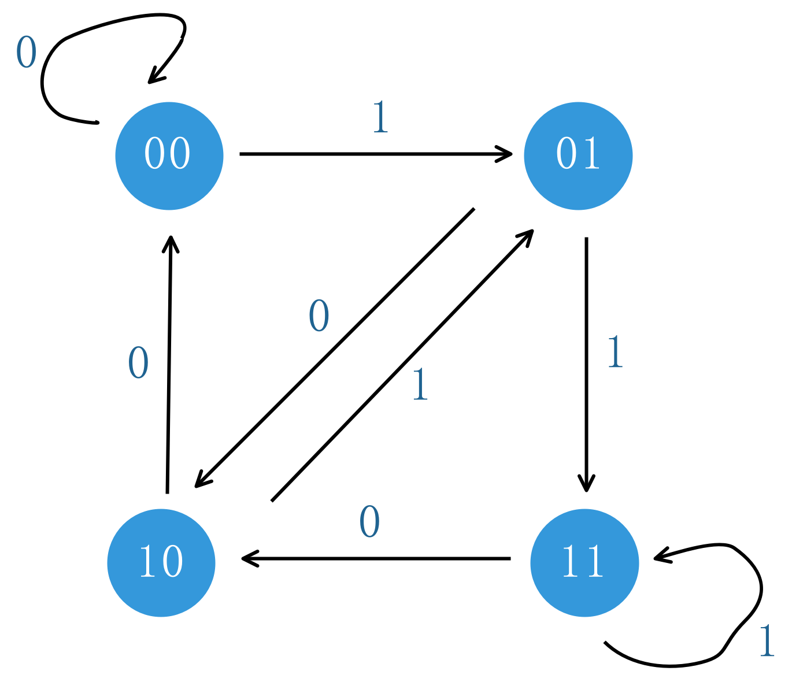

[753. 破解保险箱](https://leetcode-cn.com/problems/cracking-the-safe)

有一个需要密码才能打开的保险箱。密码是 n 位数, 密码的每一位是 k 位序列 0, 1, ..., k-1 中的一个 。

你可以随意输入密码，保险箱会自动记住最后 n 位输入，如果匹配，则能够打开保险箱。

举个例子，假设密码是 "345"，你可以输入 "012345" 来打开它，只是你输入了 6 个字符.

请返回一个能打开保险箱的最短字符串。

示例1:
输入: n = 1, k = 2
输出: "01"
说明: "10"也可以打开保险箱。

示例2:
输入: n = 2, k = 2
输出: "00110"
说明: "01100", "10011", "11001" 也能打开保险箱。

提示：
n 的范围是 [1, 4]。
k 的范围是 [1, 10]。
k^n 最大可能为 4096。

## 题意理解
描述太抽象，需要再梳理
```
以题目中两个例子为例：
n=1, k=2
密码只有一位，每位只能是0或1
那么密码可能是0，也可能是1
01 或 10 就是能打开保险箱的最短字符串

n=2， k=2
密码有2位，每一位只能是0或1，
那么密码只能是 00、 01、 10、 11， 其中一个
11001，10011，01100，00110 就是能打开保险箱的最短字符串
```
## 分析

可以把问题抽象为在图中寻找欧拉回路

可以定义每个节点为 n-1 位的数字，其中每位数字的范围是[0,k)

每个节点都可以有 k 条出边，每条边的值从 0到k-1，这样每个节点和其任意一条边会形成一个可能的 n 位数 number

将 number 的最高位去掉，又形成一个新的节点

以 n = 3， k = 2 为例；如图：



显然，节点总数是 k^(n-1)，每个节点有 k 条出边，共 k * k^(n-1) 条边

可以用深度优先搜索遍历这幅图，可以用一个哈希表记录已经访问过的数字，防止已经遍历过的数字再次遍历

因为有环，深度优先遍历要注意是后序，这也是解决欧拉回路问题的一个巧妙的点

图的欧拉回路问题，可以先看 [[332] 重新安排行程](../reconstruct-itinerary/d.go)

## [参考解答](d.go)